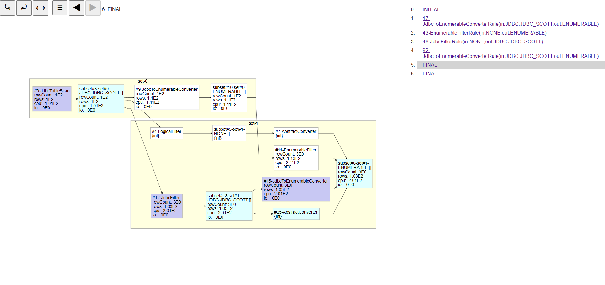
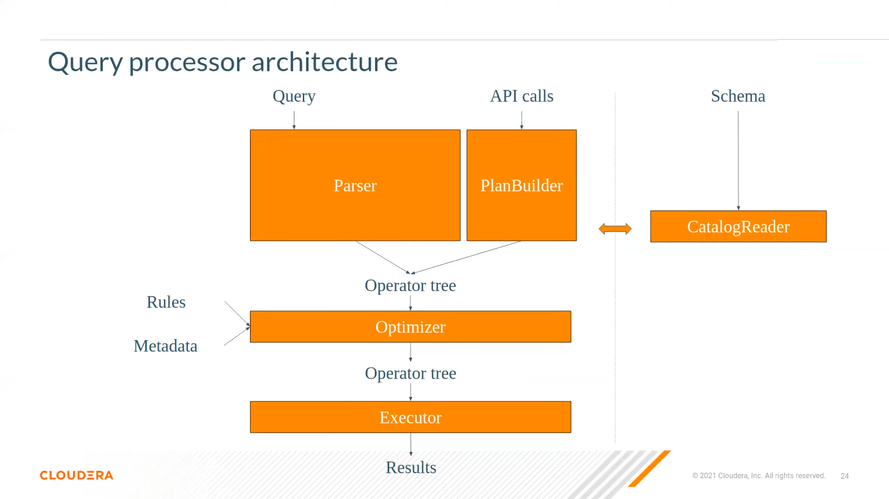
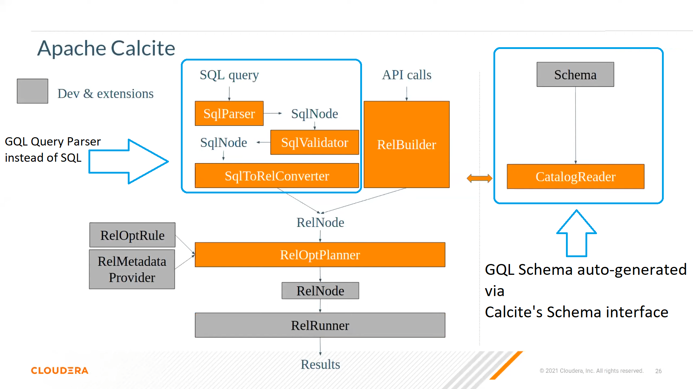
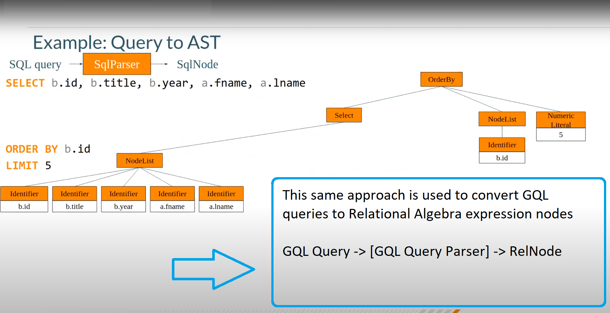
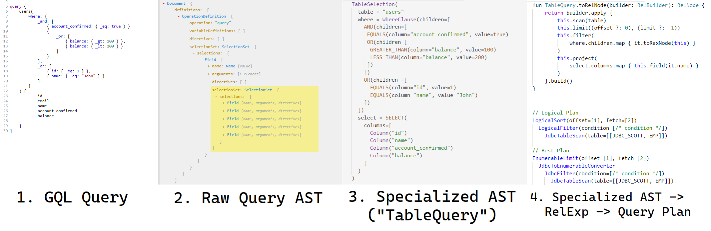
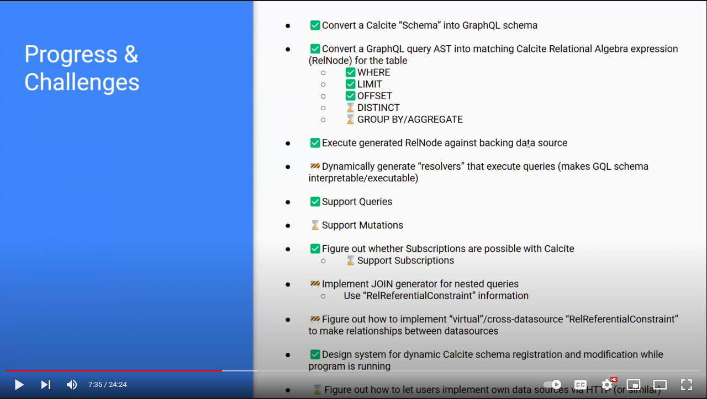

# Apache Calcite <-> Distributed, Federated GraphQL API

- [Apache Calcite <-> Distributed, Federated GraphQL API](#apache-calcite---distributed-federated-graphql-api)
- [Goals](#goals)
- [Roadmap and Current Progress](#roadmap-and-current-progress)
    - [The Roadmap](#the-roadmap)
    - [Walkthrough of Current Progress](#walkthrough-of-current-progress)
- [Technical Architecture](#technical-architecture)
    - [Approach and Design](#approach-and-design)
    - [Why Kotlin](#why-kotlin)
- [Youtube Presentation](#youtube-presentation)
- [Related Projects and Reference Material](#related-projects-and-reference-material)

This repo contains a work-in-progress prototype and research project on using Apache Calcite as the backbone of GraphQL
services.

Similar work has been done by LinkedIn on [Coral](https://github.com/linkedin/coral), though the GraphQL implementation
is not yet publically available and Coral uses an internal form of IR that is slightly modified from Calcite's.
Additionally, the goals and usecase of Coral are somewhat different from those of this project.

# Goals

**As a user I want:**

- To be able to access and modify data stored anywhere, given it has a well-defined structure (schema)
    - This includes Relational Databases, Non-relational Databases, data stored on-disk (CSV, JSON, etc)
- To be able to query data from multiple databases in a single query (distributed/federated querying)
- Ability to join across data sources by defining virtual relationships
- Performance
    - Low latency, p90 for queries competitive with a hand-written implementation
    - Federated queries should complete quickly enough to be usable in day-to-day clientside operations

**As an engineer, I want:**

- An industrial-grade query planner and optimizer backing the query execution
- Extensibility. Ability to easily write new engines/adapters to run operations on
    - IE: Exposing Airtable's API as a GraphQL/SQL-queryable source
- To work with a widely-used and mature set of tools.
- Standardization. To not invent anything myself, because:
    - A) I'm probably not qualified to do so
    - B) There are likely people who have spent the length of my lifetime thinking about and solving a similar problem

# Roadmap and Current Progress

As of today, given a Calcite schema (IE from a JDBC connection, or any other adapter), this project can generate the
corresponding GraphQL schema and execute queries successfully. (See "Walkthrough of Current Progress" below)

GraphQL queries against this schema are able to be converted into their corresponding Calcite Relational Algebra
expression, then executed against the Calcite adapter giving the proper results.

## The Roadmap

- [x] Convert a Calcite `Schema` into corresponding GraphQL Schema types
    - [x] Generate GraphQL object types for tables
    - [x] Generate `where` boolean expression type to allow filtering
- [x] Convert a GraphQL query AST into matching Calcite Relational Algebra expression (`RelNode`) for the table
    - [x] Where (critical/most important)
    - [x] Limit
    - [x] Offset
    - [ ] Distinct
    - [ ] Group By/Aggregations (nice to have)
- [x] Execute the converted Relational Algebra expression against data source, returning correct results
- [x] Automatically generate resolvers for the generated GraphQL query operations that perform the execution of the
  query (current execution is invoked manually)
- [x] Support Queries
- [ ] Support Mutations
- [x] Figure out whether it is possible to support Subscriptions with Calcite's adapter model
    - [ ] Support subscriptions if so (nice to have)
- [x] Support `JOIN` / nested GraphQL field access and queries
- [x] Design system for dynamic Calcite schema registration and modification while program is running
- [ ] Figure out how to let users implement their own data sources via HTTP (or similar)

## Walkthrough of Current Progress

To give a sense of what exactly the above translates into, here's an illustration of the current functionality.

Given the schema of some Calcite data source table, like:

```sql
CREATE TABLE "EMPS"
(
    EMPNO    int,
    DEPTNO   int,
    ENAME    text,
    HIREDATE timestamptz,
    JOB      text,
    MGR      int,
    SAL      numeric,
    COMM     numeric
);
```

A GraphQL schema is generated:

```graphql
type Query {
    EMP(limit: Int, offset: Int, order_by: String, where: EMP_bool_exp): [EMP!]
}

type EMP {
    EMPNO: Int
    # other fields...
}

input EMP_bool_exp {
    EMPNO: Int_comparison_exp
    # other fields...
    _and: [EMP_bool_exp!]
    _not: EMP_bool_exp
    _or: [EMP_bool_exp!]
}
```

Now, if we write a GraphQL query against this generated schema, something like below:

```graphql
query {
    EMP(
        limit: 2,
        offset: 1,
        where: {
            _or: [
                { DEPTNO: { _eq: 20 } },
                { DEPTNO: { _eq: 30 } }
            ]
            _and: [
                { SAL: { _gte: 1500 } }
                {
                    _or: [
                        { JOB: { _eq: "SALESMAN" } },
                        { JOB: { _eq: "MANAGER" } }
                    ]
                }
            ]
        }
    ) {
        ... columns
    }
}
```

We can execute it. Calcite allows us to do a lot of things now. For instance, here is the query plan, at various stages
of planning:

```
-- Logical Plan
LogicalSort(offset=[1], fetch=[2])
  LogicalFilter(condition=[AND(SEARCH($7, Sarg[20, 30]), >=($5, 1500), SEARCH($2, Sarg['MANAGER':CHAR(8), 'SALESMAN']:CHAR(8)))])
    JdbcTableScan(table=[[JDBC_SCOTT, EMP]])

-- Mid Plan
LogicalSort(subset=[rel#9:RelSubset#2.ENUMERABLE.[]], offset=[1], fetch=[2])
  LogicalFilter(subset=[rel#6:RelSubset#1.NONE.[]], condition=[AND(SEARCH($7, Sarg[20, 30]), >=($5, 1500), SEARCH($2, Sarg['MANAGER':CHAR(8), 'SALESMAN']:CHAR(8)))])
    JdbcTableScan(subset=[rel#4:RelSubset#0.JDBC.JDBC_SCOTT.[]], table=[[JDBC_SCOTT, EMP]])

-- Best Plan
EnumerableLimit(offset=[1], fetch=[2])
  JdbcToEnumerableConverter
    JdbcFilter(condition=[AND(SEARCH($7, Sarg[20, 30]), >=($5, 1500), SEARCH($2, Sarg['MANAGER':CHAR(8), 'SALESMAN']:CHAR(8)))])
      JdbcTableScan(table=[[JDBC_SCOTT, EMP]])
```

And here is the relational expression built out of the GraphQL query, represented as a (simplified + optimized) SQL
query. This is immensely useful for debugging purposes and understanding what's happening:

```sql
SELECT *
FROM "SCOTT"."EMP"
WHERE "DEPTNO" IN (20, 30)
  AND "SAL" >= 1500
  AND "JOB" IN ('MANAGER', 'SALESMAN')
OFFSET 1 ROWS FETCH NEXT 2 ROWS ONLY
```

And finally, the results of our query:

```sql
EMPNO
,ENAME,JOB,MGR,HIREDATE,SAL,COMM,DEPTNO

7566,JONES,MANAGER,7839,1981-02-04,2975.00,null,20,
7698,BLAKE,MANAGER,7839,1981-01-05,2850.00,null,30,
```

We can use Calcite's query plan visualizer to understand what's going on:



There is still much left to prove out, but hopefully this should give some insight as to "what the heck is it you're
trying to build"?

# Technical Architecture

## Approach and Design

The high level approach that has been pursued here can be broken down by some explanatory images.

> Note: These images are taken from [Stamatis Zampetakis](http://people.apache.org/~zabetak/) fantastic presentation on
> YouTube
>
> [_"An introduction to query processing & Apache Calcite"_](https://www.youtube.com/watch?v=p1O3E33FIs8)

The following image gives a high-level overview of the pieces of most query processors:



Below, we can see how these high-level pieces map to Calcite's API classes and interfaces, as well as the boundaries
between the "core" pieces, and which pieces are open to being written by developers as extensions.

Circled in blue are the two areas we are most interested in:

- The region depicting the `SqlParser` and `SqlToRelConverter` shows how regular SQL queries are converted/translated
  into Relational Algebra expressions. We should in theory (and in practice) be able to do a similar thing to convert
  GraphQL queries into relational expressions.
- The region on the righthand side, containing `Schema` and `CatalogReader` have been circled to call attention to how
  the Server's GraphQL API is auto-generated. We can ask Calcite to give us the Schema for any of it's data sources, and
  we are able to use the metadata from it to generate GraphQL types and resolvers.



With these pieces in place, you can see below how rather than SQL query, we might be able to write a GraphQL query with
identical semantics, and continue using Calcite as though we were a "plain-old SQL query"



Visualized in an image, the process is roughly:



Some restrictions and assumptions made about the shape of the GraphQL API and corresponding queries, and this is what
lets this entire thing be possible.

IE, the generated GraphQL schema operations only allow queries which have behaviors/semantics that can be mapped 1-to-1
to SQL.

With this, we can restrict the "domain" of GraphQL to the "domain" of standard SQL, and then our work is just one of
writing the facades/conversions.

This is a 10,000ft view of the technical architecture and approach taken to the problem in this project. For details,
see code.

## Youtube Presentation

Video from the January 2022 Apache Calcite online Meetup where a very early draft of this work was presented:

[](https://youtu.be/ae95vICkOnc "Apache Calcite 2022 Meetup January, GraphQL Presentation")

## Why Kotlin

This project is written in Kotlin.

If you were to check the commit history, you would find that there were, at one point, functioning prototypes in both
Java and Scala 3 too.

Ultimately, Kotlin struck the best balance between language features and tooling + support + ecosystem. It is an
incredibly productive and pragmatic language.

This project is performance-critical, and benchmarks showed that the latest Kotlin (1.6.10) is competitive with the
latest Java (JDK 17) in terms of performance, and in some cases idiomatic code would perform somewhat better than the
Java equivalent.

If further developments show negative performance impact from using a language other than Java, I will rewrite it all in
Java.

# Related Projects and Reference Material

- [Substrait](https://github.com/substrait-io/substrait)
- [Apache Drill](https://drill.apache.org/)
- [Trino (formerly Presto)](https://trino.io/)
- [Coral](https://github.com/linkedin/coral)
    - https://engineering.linkedin.com/blog/2020/coral
    - https://www.youtube.com/watch?v=C5t3QYch1Tk
    - https://www.dremio.com/subsurface/live/session/coral-and-transport-udfs-building-blocks-of-a-postmodern-data-warehouse/
  
  
